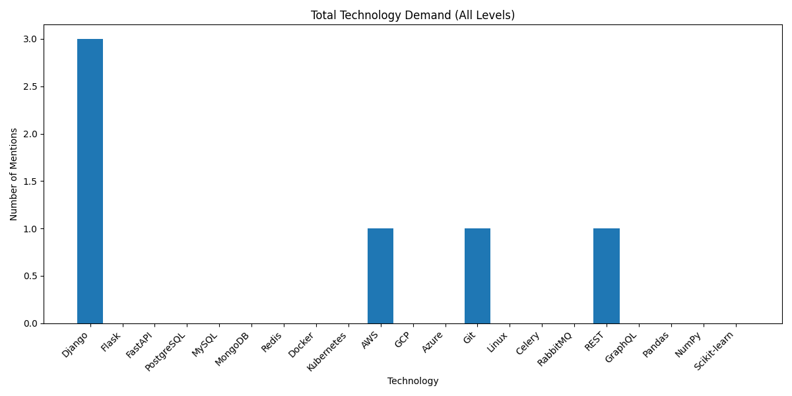

# Python Technologies Statistics

This project scrapes and analyzes Python-related job listings from [work.ua](https://www.work.ua) to determine the most in-demand technologies on the market.

It supports both **synchronous** and **asynchronous** scraping and provides analysis by experience level (Junior, Middle, Senior) with visual charts.

---

## 🚀 Features

- ✅ Scrape Python job vacancies from [work.ua](https://www.work.ua)
- ✅ Choose between `sync` or `async` scraping mode
- ✅ Count mentions of popular technologies from config
- ✅ Analyze demand by experience level: Junior / Middle / Senior
- ✅ Save results as bar charts and console tables
- ✅ Modular structure: scraping and analysis are fully separated

---

## 🛠️ Technologies Used

- Python 3.10+
- requests / aiohttp
- BeautifulSoup
- pandas
- matplotlib
- argparse
- JSON

---

## 📦 Installation

```bash
git clone https://github.com/<your-username>/python-technologies-statistics.git
cd python-technologies-statistics
pip install -r requirements.txt
```

---

## ⚙️ Usage

```bash
python main.py --mode [sync|async]
```

**Examples:**

```bash
# Synchronous scraping (default)
python main.py --mode sync

# Asynchronous scraping (faster)
python main.py --mode async
```

---

## 📁 Output

- Raw data saved to:
  - `data/raw/work_ua_vacancies.json` (sync)
  - `data/raw/work_ua_vacancies_async.json` (async)

- Charts saved to:
  - `diagrams/tech_demand_workua.png`
  - `diagrams/junior_tech_demand_workua.png`
  - `diagrams/middle_tech_demand_workua.png`
  - `diagrams/senior_tech_demand_workua.png`

---

## 📊 Sample Chart



---

## 📌 Configuration

You can edit the list of technologies and levels in:

```python
# config/config.py

TECHNOLOGIES = ['Django', 'Flask', 'FastAPI', 'PostgreSQL', ...]
EXPERIENCE_LEVELS = ['Junior', 'Middle', 'Senior']
```

---

## 🧩 Project Structure

python_technologies_statistics/
│
├── scraping/
│   ├── work_ua_parser.py
│   └── async_work_ua_parser.py
├── analysis/
│   └── analyzer.py
├── config/
│   └── config.py
├── data/
│   ├── raw/
│   └── processed/
├── diagrams/
├── requirements.txt
├── main.py
├── README.md
├── .gitignore
---

## 📊 Example Charts

You can view the example diagrams generated by the analysis here:
[View tech_demand_workua.png](diagrams/tech_demand_workua.png)  
[View junior_tech_demand_workua.png](diagrams/junior_tech_demand_workua.png)  
[View middle_tech_demand_workua.png](diagrams/middle_tech_demand_workua.png)  
[View senior_tech_demand_workua.png](diagrams/senior_tech_demand_workua.png)  